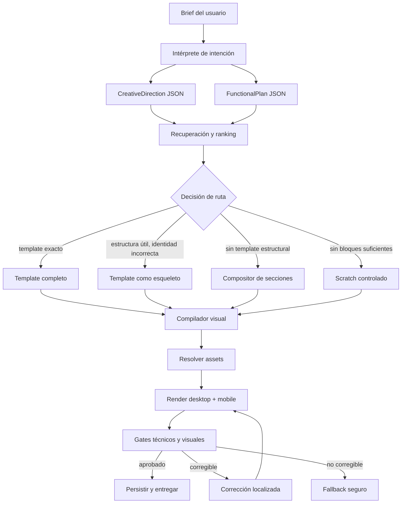

# OpenLen — sistema de generación visual de nivel mundial

> **Estado:** aprobado por Jesús el 2026-08-03<br>
> **Alcance:** generación inicial de sitios; selección, composición, tematización, assets y evaluación visual<br>
> **Objetivo:** alcanzar calidad empresarial comparable mediante evidencia con productos de referencia como v0 dentro del dominio propio de OpenLen<br>
> **Fuera de alcance:** convertir OpenLen en un agente full-stack generalista o replicar todas las funciones de v0

## 1. Decisión

OpenLen adoptará una arquitectura híbrida. Los templates y sus secciones seguirán aportando estructura, responsive, interacción y acabado artesanal. Gemini actuará como intérprete de intención, director creativo y crítico visual dentro de contratos validados. El código de OpenLen seguirá siendo responsable de seleccionar, componer, tematizar, validar y persistir el resultado.

La generación libre de HTML completo no será el camino principal. Quedará como fallback excepcional y como capacidad especializada de Scratch.

Este documento reemplaza, únicamente donde exista conflicto, la estrategia `compose` de `docs/superpowers/specs/2026-06-24-openlen-strategic-roadmap.md` que proponía clonar un template sin LLM y cambiar principalmente su identidad textual. No reemplaza la estrategia de growth partner, coach, analytics ni monetización de aquel documento.

## 2. Problema que resuelve

El flujo Quick actual selecciona un template completo, carga su HTML y rellena copy. Cuando el catálogo no contiene una identidad visual adecuada, el contenido puede ser semánticamente correcto mientras la página conserva el lenguaje visual de otra categoría.

Scratch reduce la dependencia del HTML del template, pero su referencia visual se selecciona mediante keywords amplias y un fallback fijo. La guía de generación también contiene defaults SaaS. Esto puede producir mayor variedad a costa de coherencia, coste y acabado.

El sistema actual mezcla dos conceptos que deben ser independientes:

- **Intención funcional:** secciones, acciones, contenido y capacidades necesarias.
- **Intención visual:** audiencia, dominio, emoción, arquetipo, imaginario y señales que deben evitarse.

## 3. Principios de diseño

1. **Calidad curada como sustrato.** La IA no reconstruye responsive, jerarquía ni componentes que ya existen con alta calidad.
2. **Creatividad estructurada.** Gemini decide una dirección creativa mediante JSON validado; no controla CSS arbitrario en el camino principal.
3. **Abstención explícita.** Ningún selector estará obligado a escoger el template menos incorrecto.
4. **Estructura e identidad se puntúan por separado.** Un template puede ser estructuralmente útil y visualmente incompatible.
5. **Una página, un sistema visual.** Todas las secciones compiladas comparten tokens, tipografía, geometría, tratamiento de superficies y assets.
6. **Composición con gramática.** Mezclar secciones requiere reglas de compatibilidad y ritmo; no es una selección aleatoria.
7. **Assets como parte de la dirección.** Imágenes, ilustraciones e iconos no son contenido secundario: determinan la categoría percibida.
8. **El render es la verdad.** La calidad se evalúa sobre capturas reales desktop y mobile, no únicamente sobre HTML o copy.
9. **Modelos reemplazables.** Los contratos pertenecen a OpenLen y están versionados; Gemini es un proveedor dentro de esos contratos.
10. **Cada cambio se demuestra con evals.** Ningún cambio de prompt, schema, modelo o ranking llega a producción por impresiones aisladas.

## 4. Arquitectura objetivo



## 5. Contratos principales

### 5.1 `IntentAnalysis`

```json
{
  "schema_version": "intent-analysis/1.0",
  "language": "es",
  "functional": {
    "site_type": "content_platform",
    "required_sections": [
      "coloring_gallery",
      "minigames",
      "stories",
      "creative_activities"
    ],
    "primary_actions": ["start_coloring", "play", "read"],
    "content_model": "catalog"
  },
  "audience": {
    "primary": "children",
    "age_range": "5_10",
    "secondary": ["parents"]
  },
  "domain": ["children_entertainment", "creative_play"],
  "emotional_goals": ["playful", "magical", "creative", "safe"],
  "explicit_constraints": [],
  "ambiguities": [],
  "confidence": 0.93
}
```

La confianza no decide por sí sola la ruta. Sirve para telemetría y para activar una política conservadora cuando el análisis sea ambiguo.

### 5.2 `CreativeDirection`

```json
{
  "schema_version": "creative-direction/1.0",
  "visual_archetype": "illustrated_creative_play",
  "emotional_goals": ["playful", "magical", "creative", "safe"],
  "palette": {
    "mode": "light",
    "background": "#FFF7FC",
    "surface": "#FFFFFF",
    "foreground": "#41233A",
    "primary": "#F472B6",
    "secondary": "#A78BFA",
    "accent": "#FBBF24"
  },
  "typography": {
    "display_mood": "rounded_playful",
    "body_mood": "friendly_high_legibility",
    "display_family_id": "openlen-rounded-display-01",
    "body_family_id": "openlen-readable-sans-01"
  },
  "shape_language": {
    "corner_style": "extra_round",
    "container_style": "soft_irregular",
    "border_style": "soft_colored",
    "shadow_style": "sticker_soft"
  },
  "composition": {
    "density": "low_medium",
    "rhythm": "alternating_playful",
    "image_weight": "high",
    "symmetry": "controlled_asymmetry"
  },
  "imagery": {
    "primary_medium": "storybook_vector_illustration",
    "subjects": ["coloring_pages", "animals", "crayons", "characters"],
    "consistency_group": "site_main_pack"
  },
  "iconography": {
    "family": "rounded_filled",
    "stroke_weight": "medium"
  },
  "motion": {
    "preset": "gentle_play",
    "reduced_motion_safe": true
  },
  "required_visual_signals": [
    "coloring_page_preview",
    "drawing_tool_motif",
    "child_friendly_illustration"
  ],
  "forbidden_visual_signals": [
    "saas_dashboard",
    "corporate_photography",
    "course_progress_ui",
    "institutional_education"
  ]
}
```

El schema utilizará enumeraciones para valores ejecutables. Los colores podrán ser propuestos por el modelo, pero se normalizarán y validarán por contraste. Las familias tipográficas, iconos, motion y arquetipos deberán existir en registros versionados de OpenLen.

### 5.3 `GenerationDecision`

```json
{
  "schema_version": "generation-decision/1.0",
  "route": "section_composition",
  "template_id": null,
  "structural_fit": 0.82,
  "identity_fit": 0.31,
  "selected_sections": [
    "navbar-friendly-02",
    "hero-illustrated-04",
    "gallery-cards-03",
    "activity-grid-02",
    "story-carousel-01",
    "cta-family-02",
    "footer-simple-03"
  ],
  "rejected_candidates": [
    {
      "id": "education-platform-01",
      "reason_codes": ["identity_mismatch", "forbidden_signal_course_progress"]
    }
  ]
}
```

## 6. Registry de templates y secciones

### 6.1 Metadata mínima de template

- `domains`
- `audiences`
- `age_ranges`
- `emotional_registers`
- `visual_archetypes`
- `layout_traits`
- `required_asset_types`
- `negative_tags`
- `themeability`: `low | medium | high`
- `identity_strength`: `low | medium | high`
- `supported_site_types`
- `screenshot_url`
- `metadata_version`
- `review_status`

### 6.2 Metadata mínima de sección

- Todos los campos visuales aplicables del template.
- `role`: hero, gallery, activities, stories, proof, CTA, etc.
- `content_capacity`: mínimos y máximos de items/texto.
- `composition_traits`: full-bleed, contained, asymmetric, media-first, etc.
- `compatible_predecessors` y `compatible_successors` cuando existan restricciones duras.
- `needs_js`, `responsive_status`, `a11y_status` y `theme_contract_version`.
- `quality_tier` revisado por humanos.
- Métricas históricas agregadas, nunca datos personales.

### 6.3 Gobierno del registry

- Los modelos pueden sugerir etiquetas iniciales.
- Audiencia, negative tags, quality tier y themeability requieren revisión humana antes de publicar.
- Cada cambio de metadata crea una nueva versión auditable.
- Una sección que falla un gate crítico se despublica sin borrar su historial.

## 7. Recuperación y decisión de ruta

### 7.1 Filtros duros

Antes de puntuar se descartan candidatos que:

- Contengan una señal prohibida explícita no eliminable.
- No soporten el site type requerido.
- Tengan incompatibilidad de audiencia o edad.
- Requieran assets que el pipeline no puede suministrar.
- No hayan pasado responsive o accesibilidad.

### 7.2 Puntuaciones independientes

`structural_fit` considera roles, capacidad de contenido, orden, acciones y composición.

`identity_fit` considera dominio, audiencia, emoción, arquetipo, imágenes, tipografía, formas y señales negativas.

`adaptation_cost` estima cuánto del lenguaje visual tendría que sustituirse.

`quality_prior` proviene de revisión humana y evals, no de popularidad bruta.

La primera versión utilizará reglas y pesos legibles. Un reranker aprendido solo podrá sustituirla cuando exista un dataset suficiente y demuestre mejora offline y en A/B.

### 7.3 Política inicial de rutas

Los umbrales siguientes son valores iniciales de calibración, no verdades permanentes:

- Template completo: `structural_fit >= 0.75`, `identity_fit >= 0.80`, sin filtro duro fallido.
- Template como esqueleto: `structural_fit >= 0.75`, `identity_fit < 0.80`, `themeability = high` y `adaptation_cost <= 0.60`.
- Composición: no existe template aceptable, pero hay cobertura suficiente de roles con secciones compatibles.
- Scratch controlado: faltan bloques necesarios o el producto requiere una composición genuinamente nueva.
- Fallo seguro: no puede producirse una página que pase los gates. Se informa al usuario y se conserva el draft más seguro; no se entrega silenciosamente una categoría incorrecta.

La calibración final se realizará contra el dataset de evals. Los umbrales se versionarán.

## 8. Compositor de secciones

El compositor recibe `FunctionalPlan`, `CreativeDirection` y candidatos ya filtrados.

### 8.1 Reglas obligatorias

- Máximo un navbar y un footer.
- Satisfacer todos los roles funcionales obligatorios.
- No repetir más de dos patrones compositivos equivalentes consecutivos.
- Alternar densidad y peso visual de manera coherente.
- Compartir un único ancho de contenido o una transición explícita entre anchos.
- Limitar cambios de fondo y full-bleed.
- Mantener una única jerarquía tipográfica.
- Respetar dependencias JavaScript y políticas de publicación.
- Evitar seams de espaciado entre fragmentos.

### 8.2 Variación sin degradación

La variedad provendrá de:

- Selección entre grupos de variantes con calidad equivalente.
- Diferentes gramáticas de composición compatibles con el brief.
- Dirección creativa y paquetes de assets.
- Rotación determinista mediante seed dentro del top group; nunca entre candidatos con peor categoría visual.

## 9. Compilador visual

El compilador convierte `CreativeDirection` en tokens y reglas que el motor actual pueda aplicar.

Debe controlar como mínimo:

- Paleta semántica light/dark.
- Escalas tipográficas y font loading.
- Radius, spacing y text scale.
- Sombras, bordes y tratamiento de superficies.
- Botones, cards, badges y navegación.
- Motivos decorativos versionados.
- Iconografía.
- Motion y reduced motion.
- Reglas de crop, aspect ratio y tratamiento de imágenes.

El resultado se normaliza al contrato `--ol-*`. Una sección no podrá preservar tokens locales que contradigan la dirección global salvo excepciones declaradas y verificadas.

## 10. Pipeline de assets

El `AssetManifest` se genera después de la dirección creativa y antes del render final.

Orden de resolución:

1. Asset curado con coincidencia exacta de dominio, audiencia y estilo.
2. Paquete generado coherente bajo un mismo `consistency_group`.
3. Asset abstracto o ilustrado compatible.
4. Placeholder diseñado que no cambie la categoría percibida.

No se usará una fotografía o ilustración de una categoría incompatible como fallback. El manifiesto almacenará fuente, derechos o procedencia, prompt cuando aplique, checksum y versión.

## 11. Gates técnicos y visuales

### 11.1 Renderes

- Desktop completo.
- Mobile completo.
- Primer viewport desktop y mobile.
- Captura con texto difuminado o sustituido por bloques neutrales.

### 11.2 Gate técnico determinista

- HTML y sanitización.
- Overflow horizontal.
- Colisiones y contenido cortado.
- Contraste.
- Heading hierarchy.
- Alt text y labels.
- Tap targets.
- Reduced motion.
- Presupuesto de recursos y rendimiento.

### 11.3 Gate de composición

Evalúa jerarquía, ritmo, densidad, repetición, balance y continuidad entre secciones.

### 11.4 Gate de identidad

Sobre la captura con copy neutralizado debe responder:

- Categoría percibida.
- Audiencia percibida.
- Emociones percibidas.
- Señales visuales que justifican la clasificación.
- Presencia de señales obligatorias y prohibidas.

Una página infantil que solo se identifica como infantil al leer “colorear” falla este gate.

### 11.5 Política de corrección

- Máximo una corrección localizada automática por defecto.
- Reemplazar hero/assets si falla identidad del primer viewport.
- Recompilar tokens si falla coherencia visual global.
- Sustituir secciones concretas si falla composición.
- Reensamblar únicamente si el problema es estructural.
- Nunca regenerar toda la página por un defecto localizado.

El crítico será fail-closed para incompatibilidad temática crítica y fail-open únicamente para degradaciones no críticas cuando exista un resultado técnico seguro. Una caída del crítico no convertirá una coincidencia de identidad desconocida en aprobada.

## 12. Evals y objetivos internos

### 12.1 Dataset inicial

Entre 60 y 100 briefs versionados, equilibrados entre categorías cubiertas, categorías ausentes, idiomas, audiencias sensibles y prompts ambiguos. Debe incluir al menos diez casos diseñados para confundir estructura con identidad.

### 12.2 Ground truth

Cada caso tendrá:

- Roles funcionales esperados.
- Audiencia y dominio esperados.
- Señales visuales requeridas y prohibidas.
- Varias direcciones válidas para evitar premiar una única estética.
- Puntuación humana y explicación.

### 12.3 Métricas

- `wrong_visual_category_rate`.
- `masked_theme_recognition`.
- `required_signal_recall`.
- `forbidden_signal_rate`.
- `structural_completeness`.
- `responsive_critical_failure_rate`.
- `a11y_critical_failure_rate`.
- Preferencia ciega contra el baseline Quick actual.
- Preferencia ciega contra referencias externas obtenidas de forma autorizada.
- Aceptación, regeneración, reemplazo de sección, publicación y reversión.
- Latencia y coste p50/p95 por ruta.

### 12.4 SLOs de lanzamiento propuestos

Estos son objetivos internos iniciales y deberán revisarse con datos:

- Categoría visual incorrecta: menor a 3% en el dataset aprobado.
- Reconocimiento de tema/audiencia con copy neutralizado: al menos 90%.
- Fallos responsive críticos: menor a 2%.
- Fallos críticos de accesibilidad determinista: 0%.
- Preferencia frente a Quick actual: al menos 70%.
- Ninguna regresión estadísticamente relevante en tasa de publicación.

### 12.5 Calibración del juez

Los jueces automáticos se compararán con ratings humanos. No podrán bloquear producción hasta alcanzar una concordancia aceptada y documentada para cada criterio. Se probará el sesgo de posición ejecutando comparaciones A/B en ambos órdenes.

## 13. Observabilidad y reproducibilidad

Cada generación persistirá:

- Brief y perfil aplicado.
- Versiones de modelos, prompts, schemas, registry y umbrales.
- Análisis de intención y dirección creativa.
- Candidatos, puntuaciones, filtros y razones de descarte.
- Ruta seleccionada.
- Secciones, template y assets utilizados.
- Tokens compilados.
- Capturas y verdictos.
- Correcciones realizadas.
- Tokens, coste, latencia y errores por etapa.
- Resultado posterior del usuario sin almacenar contenido sensible innecesario.

Con ese registro debe poder reproducirse una generación utilizando las mismas versiones y seed.

## 14. Seguridad, privacidad y gobierno

- Sanitización posterior a cualquier salida de modelo.
- Lista permitida de fuentes, iconos, motion y valores ejecutables.
- Ningún script generado libremente en Quick.
- Moderación adicional para audiencias infantiles y contenido sensible.
- Minimización de datos en prompts y logs.
- Separación por cuenta, retención definida y eliminación verificable.
- Feature flags, canary releases y rollback por versión de pipeline.
- Presupuestos y circuit breakers por modelo y etapa.
- Fallbacks explícitos; ningún error se oculta sustituyéndolo por un template semánticamente incorrecto.

## 15. Evolución de los modos de OpenLen

### Quick

Se convierte en el pipeline híbrido. Puede usar template completo, esqueleto o composición según evidencia. Sigue optimizado para coste y velocidad, pero no sacrifica identidad visual crítica.

### Scratch

Permanece como capacidad Pro para necesidades no cubiertas por el registry. Recibe la misma dirección creativa, assets, normalización y gates que Quick. Su libertad está en la composición y el HTML, no en saltarse controles.

### Editor

Las ediciones posteriores conservan `CreativeDirection` como memoria de marca del proyecto. Una petición localizada puede modificar el contrato o una sección sin perder el resto de la identidad.

## 16. Hoja de ruta con puertas

### Etapa 0 — Baseline

- Crear dataset, harness, capturas y ratings humanos.
- Ejecutar Quick y Scratch actuales.
- Medir coste, latencia, fallos y preferencia.

**Puerta:** baseline reproducible en CI o runner de evals y scorecard revisable.

### Etapa 1 — Selección segura

- Extender metadata de templates.
- Implementar análisis funcional/visual separado.
- Añadir filtros duros, puntuaciones independientes y abstención.
- Eliminar selección aleatoria fuera del grupo de calidad equivalente.

**Puerta:** cero templates completos de categoría prohibida en los casos adversariales aprobados.

### Etapa 2 — Dirección creativa y compilador

- Versionar schemas.
- Ampliar tokens y presets.
- Aplicar creative direction a templates estructuralmente útiles.
- Implementar primer AssetManifest.

**Puerta:** dos direcciones sobre la misma estructura son reconocidas como identidades distintas con copy neutralizado.

### Etapa 3 — Registry y composición

- Enriquecer metadata de secciones.
- Añadir gramática, compatibilidad y scoring.
- Integrar el assembler actual en Quick.
- Incorporar secciones por categorías de demanda.

**Puerta:** composición iguala o supera templates completos en coherencia y craft dentro del eval set.

### Etapa 4 — Closed-loop visual

- Capturas multi-viewport y neutralizadas.
- Gates separados de técnica, composición e identidad.
- Correcciones localizadas.
- Calibrar jueces contra humanos.

**Puerta:** juez calibrado y reducción demostrada de fallos entregados.

### Etapa 5 — Aprendizaje y optimización

- Instrumentar aceptación, regeneración, publicación y reemplazo.
- Entrenar o configurar reranker únicamente con datos depurados.
- A/B por pipeline versionado.
- Optimizar coste y latencia sin reducir los SLOs.

**Puerta:** reranker mejora aceptación/publicación y pasa no-regression evals.

### Etapa 6 — Hardening empresarial

- Reproducción, canaries, rollbacks y circuit breakers.
- Dashboards de calidad/coste/latencia.
- Políticas de privacidad, retención e incidentes.
- Revisión de seguridad, accesibilidad y operaciones.

**Puerta:** checklist operativo aprobado y ejercicio real de rollback completado.

## 17. Estrategia de entrega

Las etapas se activarán por cohortes mediante feature flag. El pipeline anterior permanecerá disponible como rollback hasta que la nueva ruta cumpla sus puertas durante un periodo estable. No se migrarán todos los templates o secciones antes de demostrar el sistema con cinco arquetipos representativos:

1. Infantil creativo.
2. Restaurante/hospitality.
3. Wellness orgánico.
4. SaaS técnico.
5. Portfolio editorial.

Estas categorías prueban extremos de audiencia, imágenes, densidad y composición.

## 18. Pruebas requeridas

### Unitarias

- Validación y migración de schemas.
- Filtros duros y reason codes.
- Scoring y rutas por umbral.
- Gramática de composición.
- Compilación de tokens y contraste.
- Resolución y fallback de assets.

### Integración

- Brief a `GenerationDecision` con catálogo fixture.
- Composición a HTML born-canonical.
- Persistencia completa del trace.
- Fallbacks de timeout, modelo y storage.
- Idempotencia por generation id.

### Visuales

- Desktop y mobile por arquetipo.
- Comparación de seams y overflow.
- Copy neutralizado para reconocimiento temático.
- Reduced motion.
- Orden invertido en comparaciones pairwise.

### End-to-end

- Quick exact-match.
- Quick skeleton-reskin.
- Quick section-composition.
- Scratch controlado.
- Fallo crítico sin entrega silenciosa.
- Corrección localizada y persistencia.
- Rollback a pipeline anterior.

## 19. Riesgos y mitigaciones

| Riesgo | Mitigación |
|---|---|
| Las secciones mezcladas parecen un collage | Gramática, tokens globales, seams audit y evals de composición |
| Gemini produce dirección válida pero genérica | Señales obligatorias/prohibidas, assets y ground truth múltiple |
| Metadata incorrecta contamina retrieval | Revisión humana de campos críticos y versionado |
| El crítico aprueba sus propios defectos | Jueces separados, copy neutralizado, calibración humana y orden invertido |
| Coste o latencia crecen demasiado | Routing por confianza, modelos por etapa, caching cuando esté soportado y presupuestos |
| El catálogo limita categorías nuevas | Abstención, composición y Scratch controlado; incorporar bloques según demanda medida |
| Las páginas vuelven a verse iguales | Variación en gramática, secciones, dirección creativa y assets dentro de top groups equivalentes |
| Un cambio de modelo causa regresiones | Model registry, eval gate, canary y rollback |

## 20. Criterio de éxito estratégico

OpenLen alcanza el objetivo cuando, dentro de su dominio:

- Gana o empata consistentemente comparaciones ciegas frente a referencias de primer nivel.
- La temática y audiencia se reconocen sin leer el copy.
- La calidad no depende de un modelo o prompt particular.
- Cada decisión puede explicarse, reproducirse y revertirse.
- Los fallos se detectan antes de la entrega.
- El registry mejora acumulativamente con uso y evaluación.
- El usuario puede editar sin destruir la identidad ya conseguida.

## 21. Fuentes primarias consultadas

Consulta: 2026-08-03.

- Vercel, [v0 Design Systems](https://v0.dev/docs/design-systems): registry, componentes, bloques y tokens como contexto estructurado para modelos.
- Vercel, [AI-powered prototyping with design systems](https://vercel.com/blog/ai-powered-prototyping-with-design-systems): componentes abiertos, APIs composables y styling basado en tokens.
- Google, [Gemini Structured Outputs](https://ai.google.dev/gemini-api/docs/structured-output): JSON Schema y necesidad de validación semántica adicional.
- Google, [Gemini Image Understanding](https://ai.google.dev/gemini-api/docs/image-understanding): clasificación y visual question answering sobre imágenes, con postprocesamiento y evaluación humana.
- Google Cloud, [Evaluate a judge model](https://docs.cloud.google.com/vertex-ai/generative-ai/docs/models/evaluate-judge-model): calibración de jueces automáticos contra ratings humanos.

No hay evidencia pública suficiente para afirmar que el pipeline interno de v0 sea igual al aquí propuesto. v0 se utiliza como referencia de calidad y madurez de producto, no como arquitectura afirmada.
